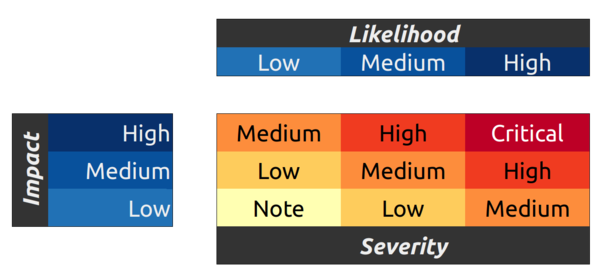

Security of the platform is our highest priority.
All contract code and balances are publicly verifiable, and security researchers are eligible for a bug bounty for reporting undiscovered vulnerabilities.

## Audit

UMA encourages the community to audit our contracts and security; we also encourage the responsible disclosure of any issues.
The bug bounty program is intended to recognize the value of working with the community of independent security researchers, and sets out our definition of good faith in the context of finding and reporting vulnerabilities, as well as what you can expect from us in return.

The contracts in [the common directory](https://github.com/UMAprotocol/protocol/tree/9d403ddb5f2f07194daefe7da51e0e0a6306f2c4/core/contracts/common) and [the oracle directory](https://github.com/UMAprotocol/protocol/tree/9d403ddb5f2f07194daefe7da51e0e0a6306f2c4/core/contracts/oracle) of the `/protocol` repo have been carefully audited by OpenZeppelin.
The audit report can be found [here](https://blog.openzeppelin.com/uma-audit-phase-1/).

The contracts in [the financial-templates directory](https://github.com/UMAprotocol/protocol/tree/e6eaa48124ae3f209fb117cf05eb18292cf26d21/core/contracts/financial-templates/implementation) have been audited by OpenZeppelin.
The audit report can be found [here](https://blog.openzeppelin.com/uma-audit-phase-2/).

Updates to the Expiring Multiparty contracts and flash loan mitigations for the voting contracts have been audited by OpenZeppelin. The audit report can be found [here](https://blog.openzeppelin.com/uma-audit-phase-3/).

The [Perpetual Multiparty](https://github.com/UMAprotocol/protocol/tree/1631ef7ad29aaeba756ef3b9a01c667e1343df85/packages/core/contracts/financial-templates/perpetual-multiparty) and [Optimistic Oracle](https://github.com/UMAprotocol/protocol/tree/1631ef7ad29aaeba756ef3b9a01c667e1343df85/packages/core/contracts/oracle) have been audited by OpenZeppelin. The audit report can be found [here](https://blog.openzeppelin.com/uma-audit-phase-4/).

Additionally, OpenZeppelin audits incremental upgrades to UMA's contracts on a continuous basis. The continuous audit report can be found [here](https://blog.openzeppelin.com/uma-continuous-audit/).

## Rewards

UMA offers substantial rewards for discoveries that can prevent the loss of assets, the freezing of assets, or harm to users.

All rewards will be paid in $UMA, and the amount of compensation will vary depending on bug severity. Reward amounts typically correspond to severity in the following manner.

|  Severity                | Reward amount in USD | 
| ----------------------- | ------------------ | 
| Low                     | $250                  | 
| Medium  | $3,000 |
| High | $10,000 |
| Critical | 10% of funds at risk |

Severity is calculated according to the [OWASP](https://owasp.org/www-project-risk-assessment-framework/) risk rating model based on Impact and Likelihood.

## Scope

The scope of our bug bounty program includes any and all of UMA's production smart contracts.
It does not include known issues with the intended behavior.
Our [documentation site](https://docs.umaproject.org/) has an extensive overview of the intended behavior of the system.

### In scope:

- All UMA smart contracts that are deployed to mainnet: [link](https://github.com/UMAprotocol/protocol/tree/master/packages/core/contracts/).
  - Note: this does not include smart contracts that have not been deployed in a production capacity (test deployments for instance).
- Bot code to support actively deployed smart contracts: [link](https://github.com/UMAprotocol/protocol/tree/master/packages/).

### Examples of what’s in scope:

- Being able to steal funds
- Being able to freeze funds or render them inaccessible by their owners

### Out of scope:

- Issues that have already been submitted by another user or are already known to the UMA team
  - Note: this includes bugs known to the UMA team, but have not been disclosed due to active mitigation efforts.
- Vulnerabilities in contracts built on top of the protocol by third-party developers (such as smart contract wallets)
- Vulnerabilities that require ownership of an admin key
- Any files, modules or libraries other than the ones mentioned above
- More efficient gas solutions
- Any points listed as an already known weaknesses
- Any points listed in an audit report

## Submissions

Please email your submissions to bugs@umaproject.org.

The submission must include clear and concise steps to reproduce the discovered vulnerability.

## Terms & Conditions

If you comply with the policies below when reporting a security issue to us, we will not initiate a lawsuit or law enforcement investigation against you in response to your report.

We ask that you:

- Report any vulnerability you’ve discovered promptly.
- Avoid violating the privacy of others, disrupting our systems, destroying data, or harming user experience.
- Use only bugs@umaproject.org to discuss vulnerabilities with us.
- Keep the details of any discovered vulnerabilities confidential until they are publicly announced by Risk Labs on the [documentation website](https://docs.umaproject.org/).
- Perform testing only on in-scope systems, and respect systems and activities which are out-of-scope.
- Not engage in blackmail, extortion, or any other unlawful conduct.
- Not be a current or former UMA Foundation employee, vendor, contractor, or the employee of an UMA vendor or contractor.

Public disclosure of the bug or the indication of an intention to exploit it on Mainnet will make the report ineligible for a bounty.
If in doubt about other aspects of the bounty, most of the [Ethereum Foundation bug bounty program rules](https://bounty.ethereum.org/) will apply.

Any questions?
Reach us via email (bugs@umaproject.org).
For more information on the UMA platform, check out our [website](http://www.umaproject.org) and [Github](https://github.com/UMAprotocol/).

All reward determinations, including eligibility and payment amount, are made at UMA’s sole discretion.
UMA reserves the right to reject submissions and alter the terms and conditions of this program without notice.
